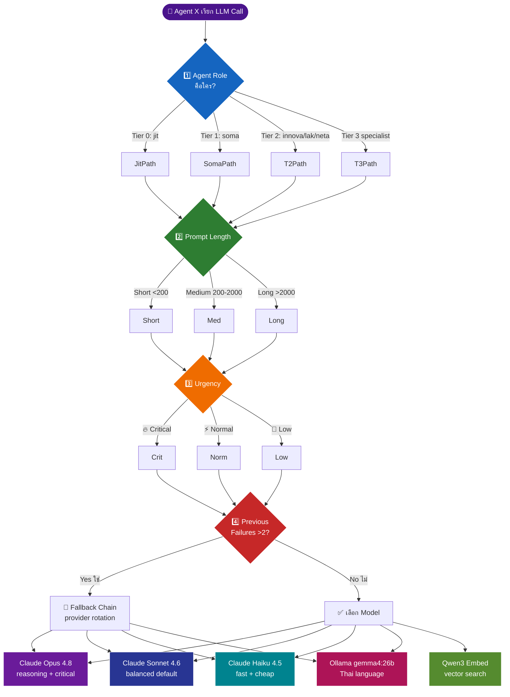
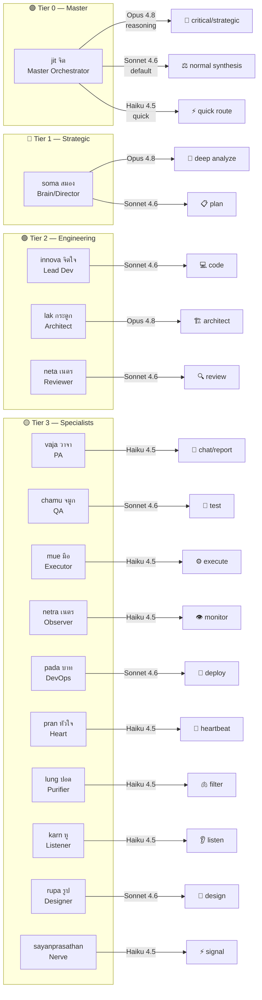
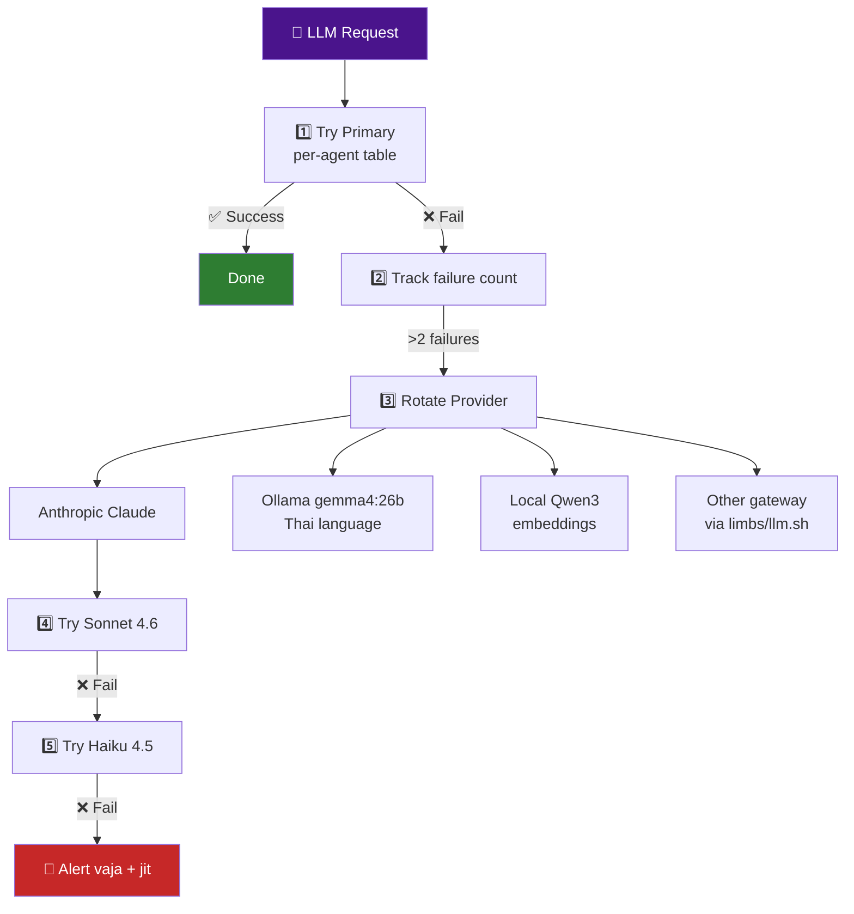

# 🌳 Decision Tree: ล่าม COMMANDCODE — "Agent X เรียก LLM Call → เลือก Model ไหน"

> **คำสั่ง**: `ล่าม COMMANDCODE` — ตัวล่ามกลางที่ช่วย organ แต่ละตัวเลือก model ที่เหมาะสมที่สุด
> **เกณฑ์ตัดสิน**: (1) agent role, (2) prompt length, (3) urgency, (4) previous failures
> **ผลลัพธ์**: mermaid flowchart + table per agent

---

## 🧭 Mermaid Flowchart (ภาพรวม)



---

## 📊 Mermaid Flowchart (แยกตาม Tier)



---

## 📋 Decision Table — Per Agent (15 agents)

### 🟣 Tier 0: Master Orchestrator

| Agent | Role | Short <200 | Medium 200-2000 | Long >2000 | Critical | Normal | Low | Failures >2 |
|-------|------|-----------|-----------------|-----------|----------|--------|-----|-------------|
| **jit (จิต)** | Master Orchestrator | Sonnet 4.6 | **Opus 4.8** | **Opus 4.8** | **Opus 4.8** | Sonnet 4.6 | Haiku 4.5 | → Fallback chain |

> 💡 jit เป็น soul ของระบบ → ใช้ Opus 4.8 เป็นหลัก เพราะต้องตัดสินใจข้าม 15 organs

---

### 🔵 Tier 1: Strategic Lead

| Agent | Role | Short <200 | Medium 200-2000 | Long >2000 | Critical | Normal | Low | Failures >2 |
|-------|------|-----------|-----------------|-----------|----------|--------|-----|-------------|
| **soma (สมอง)** | Brain/Director | Sonnet 4.6 | **Opus 4.8** | **Opus 4.8** | **Opus 4.8** | Sonnet 4.6 | Haiku 4.5 | → Rotate Opus→Sonnet→Haiku |

> 💡 soma คิดเชิงกลยุทธ์ → Opus 4.8 สำหรับ architecture-level decisions

---

### 🟢 Tier 2: Core Engineering

| Agent | Role | Short <200 | Medium 200-2000 | Long >2000 | Critical | Normal | Low | Failures >2 |
|-------|------|-----------|-----------------|-----------|----------|--------|-----|-------------|
| **innova (จิตใจ)** | Lead Developer | Sonnet 4.6 | Sonnet 4.6 | **Opus 4.8** | Sonnet 4.6 | Sonnet 4.6 | Haiku 4.5 | → Ollama gemma4:26b (Thai) |
| **lak (กระดูก)** | Solution Architect | Sonnet 4.6 | **Opus 4.8** | **Opus 4.8** | **Opus 4.8** | Opus 4.8 | Sonnet 4.6 | → Sonnet 4.6 fallback |
| **neta (เนตร)** | Code Reviewer | Haiku 4.5 | Sonnet 4.6 | **Opus 4.8** | **Opus 4.8** | Sonnet 4.6 | Haiku 4.5 | → Re-review with Opus |

> 💡 innova เขียน code เป็นหลัก → Sonnet 4.6 เร็วและพอ / lak ออกแบบ → Opus 4.8 / neta รีวิว → Opus ตรวจ security

---

### 🟡 Tier 3: Specialists (12 agents)

| Agent | Organ | Short <200 | Medium 200-2000 | Long >2000 | Critical | Normal | Low | Failures >2 |
|-------|-------|-----------|-----------------|-----------|----------|--------|-----|-------------|
| **vaja (วาจา)** | ปาก / PA | Haiku 4.5 | Haiku 4.5 | Sonnet 4.6 | Sonnet 4.6 | Haiku 4.5 | Haiku 4.5 | → Sonnet 4.6 |
| **chamu (จมูก)** | จมูก / QA | Haiku 4.5 | Sonnet 4.6 | Sonnet 4.6 | **Opus 4.8** | Sonnet 4.6 | Haiku 4.5 | → Opus 4.8 retest |
| **mue (มือ)** | มือ / Executor | Haiku 4.5 | Haiku 4.5 | Sonnet 4.6 | Sonnet 4.6 | Haiku 4.5 | Haiku 4.5 | → Sonnet 4.6 |
| **netra (เนตร)** | ตา / Observer | Haiku 4.5 | Haiku 4.5 | Sonnet 4.6 | Sonnet 4.6 | Haiku 4.5 | Haiku 4.5 | → Sonnet 4.6 |
| **pada (บาท)** | ขา / DevOps | Haiku 4.5 | Sonnet 4.6 | Sonnet 4.6 | **Opus 4.8** | Sonnet 4.6 | Haiku 4.5 | → Ollama local |
| **pran (หัวใจ)** | หัวใจ / Heart | Haiku 4.5 | Haiku 4.5 | Sonnet 4.6 | Sonnet 4.6 | Haiku 4.5 | Haiku 4.5 | → Sonnet 4.6 |
| **lung (ปอด)** | ปอด / Purifier | Haiku 4.5 | Haiku 4.5 | Sonnet 4.6 | Sonnet 4.6 | Haiku 4.5 | Haiku 4.5 | → Sonnet 4.6 |
| **karn (หู)** | หู / Listener | Haiku 4.5 | Haiku 4.5 | Haiku 4.5 | Sonnet 4.6 | Haiku 4.5 | Haiku 4.5 | → Sonnet 4.6 |
| **rupa (รูป)** | รูปลักษณ์ / Designer | Sonnet 4.6 | Sonnet 4.6 | **Opus 4.8** | **Opus 4.8** | Sonnet 4.6 | Haiku 4.5 | → Opus 4.8 |
| **sayanprasathan** | ระบบประสาท / Nerve | Haiku 4.5 | Haiku 4.5 | Sonnet 4.6 | Sonnet 4.6 | Haiku 4.5 | Haiku 4.5 | → Sonnet 4.6 |

> 💡 Tier 3 ส่วนใหญ่ใช้ **Haiku 4.5** เป็น default — เร็ว ถูก และ task ไม่ซับซ้อน / ยกเว้น **rupa** (visual) และ **chamu/pada** (critical path) ใช้ Opus

---

## 🔄 Model Pool & Fallback Chain



### Fallback Order (เมื่อ failures > 2)

| Priority | Provider | Model | Use Case |
|----------|----------|-------|----------|
| 1 | Anthropic | **Opus 4.8** | reasoning, architecture, security |
| 2 | Anthropic | **Sonnet 4.6** | code, review, deploy |
| 3 | Anthropic | **Haiku 4.5** | chat, monitor, signal, execute |
| 4 | MDES Ollama | **gemma4:26b** | Thai language, Thai processing |
| 5 | Local | **Qwen3-Embed** | vector search, embeddings |
| 6 | Gateway | **limbs/llm.sh** | multi-provider rotation |

---

## 🎯 Quick Reference Card

```
┌─────────────────────────────────────────────────────────┐
│  🧠 ล่าม COMMANDCODE — เลือก Model ใน 3 วินาที          │
├─────────────────────────────────────────────────────────┤
│  jit / soma / lak / neta (critical)  → Opus 4.8        │
│  innova / neta (normal code)         → Sonnet 4.6      │
│  vaja / mue / netra / pran / karn    → Haiku 4.5       │
│  lung / sayanprasathan               → Haiku 4.5       │
│  chamu / pada (critical path)        → Opus 4.8        │
│  rupa (design/visual)                → Opus 4.8        │
│  Thai language (ทุก agent)            → Ollama gemma4:26b│
│  Failures >2                         → Rotate provider │
└─────────────────────────────────────────────────────────┘
```

---

## 🧪 Decision Pseudocode (สำหรับ implementation)

```python
def choose_model(agent: str, prompt: str, urgency: str, fail_count: int) -> str:
    # 1. Failover first
    if fail_count > 2:
        return rotate_provider(agent)  # Sonnet → Haiku → Ollama → local

    # 2. Critical → always Opus (or upgrade)
    if urgency == "critical":
        return "claude-opus-4-8"

    # 3. Length-based routing
    length = len(prompt)
    if length < 200:
        return SHORT_DEFAULT[agent]      # mostly Haiku
    elif length < 2000:
        return MEDIUM_DEFAULT[agent]     # mostly Sonnet
    else:
        return LONG_DEFAULT[agent]       # mostly Opus for complex

    # 4. Thai content → Ollama
    if is_thai(prompt):
        return "ollama/gemma4:26b"
```

---

## 📌 สรุปกฎเหล็ก 4 ข้อ

| # | กฎ | ตัวอย่าง |
|---|-----|---------|
| 1 | **Role สำคัญที่สุด** — Tier 0/1 ใช้ Opus, Tier 3 ใช้ Haiku เป็นหลัก | jit → Opus, mue → Haiku |
| 2 | **Prompt ยาว → model แรงขึ้น** | code review >2000 tokens → Opus |
| 3 | **Critical = ยกระดับทันที** | chamu/pada critical → Opus แม้ปกติใช้ Sonnet |
| 4 | **Failures >2 = rotate provider** | Anthropic ล้ม → Ollama → local |

🤖 Opus 4.8