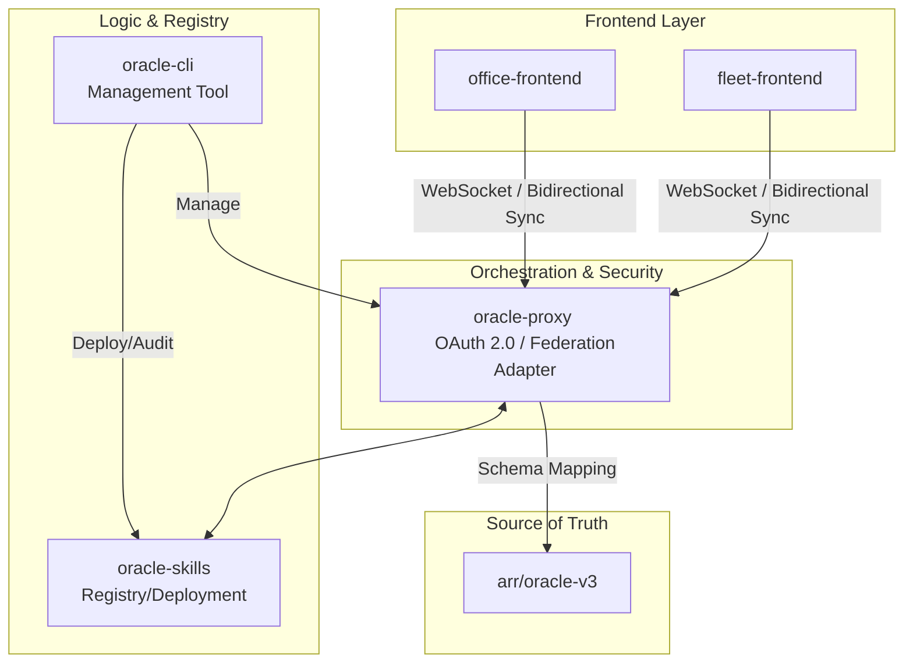

**Summary (สรุปผล):**
รายงานฉบับนี้เป็นการสังเคราะห์ข้อมูลจากหน่วยงานระดับ Haiku เพื่อประเมินความพร้อมของระบบ Oracle Ecosystem พบว่าโครงสร้างพื้นฐานมีองค์ประกอบสำคัญครบถ้วน (Proxy, CLI, Skills) แต่ยังขาด **"กลไกการเชื่อมโยงข้อมูลแบบ Real-time (CDC)"** และ **"มาตรฐาน Schema กลาง (Common Data Schema v1)"** ที่ยืดหยุ่นพอ ปัญหาหลักคือความล่าช้า (Latency) และความแข็งตัวของ Schema ในฝั่ง Frontend ซึ่งหากไม่เร่งแก้ไขเรื่อง Bidirectional Sync และการทำ Audit ระบบ Deployment (Skills Registry) จะทำให้การขยายระบบแบบ Federation ล้มเหลวเนื่องจากข้อมูลไม่สอดคล้องกัน

---

# Synthesis Report: Oracle Ecosystem Orchestration
**Status:** Tier 2 Orchestrator Review (Sonnet)  
**Scope:** Oracle Ecosystem Integrity & Federation Readiness  
**Target Path:** `plans/oracle-ecosystem-sync.md`

## 1. Architecture Summary
The Oracle Ecosystem is envisioned as a multi-layered middleware architecture designed to facilitate federated data access and skill execution. The functional flow is structured as follows:

*   **Access Layer (`fleet/office frontends`):** The user interface consumption layer, currently reliant on standard API calls but requiring WebSocket upgrades for real-time state synchronization.
*   **Gateway Layer (`oracle-proxy`):** The core intelligent orchestrator acting as an API Gateway. It handles OAuth 2.0 authentication, Identity Federation, and serves as the adapter between disparate schemas and the unified proxy layer.
*   **Logic & Capability Layer (`oracle-skills`):** A modular repository of executable logic/functions (Skills) that can be dynamically invoked via the proxy.
*   **Management Layer (`oracle-cli`):** The administrative interface for deploying, auditing, and managing skills and registry configurations.
*   **Execution Core (`arr/v3`):** The underlying data source/backend where the actual state resides.

## 2. Gap Analysis
Comparing the current state against **Opus's "Common Data Schema v1"**, the following gaps are identified:

| Feature | Current State (Haiku Findings) | Required for Common Data Schema v1 |
| :--- | :--- | :--- |
| **Data Synchronization** | Unidirectional/Polling-based; missing CDC. | **Bidirectional Sync** + Change Data Capture (CDC). |
| **Schema Flexibility** | Rigid, causing frontend bottlenecks. | **Dynamic Schema Mapping** via Proxy adapter. |
| **Deployment Logic** | `oracle-skills` registry mechanism is undefined. | Standardized **Registry/Manifest** for skill discovery. |
| **Feature Parity** | `maw.js` exists only as an aspiration. | Implementation of **Automated Workflow (MAW)** logic. |

## 3. Critical Path (Unblocking Federation)
To achieve a functional Federated state, the following must be prioritized to eliminate current blockers:

1.  **Implement CDC & WebSocket Layer:** Move from request-response to a streaming architecture in `oracle-proxy` to solve the latency and synchronization gap in frontends.
2.  **Standardize Skill Registry:** Define the deployment lifecycle within `oracle-skills` so that `oracle-cli` can push updates without breaking the proxy.
3.  **Schema Abstraction:** Refactor `oracle-proxy` to act as a true "Transformer" that maps legacy or rigid schemas into the **Common Data Schema v1** before they reach the frontend.

## 4. Integration Map

## 5. Recommendations (Top 3 Next Traces)
1.  **Deep Dive: `oracle-proxy` Transformation Logic**
    *   Focus: Investigate the feasibility of implementing a middleware mapping layer that converts incoming backend data to Common Data Schema v1.
2.  **Audit: `oracle-skills` Registry Protocol**
    *   Focus: Define the JSON/YAML manifest structure required for a skill to be "deployable" via `oracle-cli`.
3.  **Prototype: CDC Implementation in `arr/v3` $\rightarrow$ `proxy`**
    *   Focus: Test latency impacts of implementing Change Data Capture (CDC) on the data stream.

## 6. Risk Flags
*   **⚠️ Data Inconsistency:** Without Bidirectional Sync, the Frontend and Backend will diverge, leading to "Split-brain" scenarios in federated nodes.
*   **⚠️ Security Vulnerability:** If `oracle-cli` auditing is not completed, unverified or malicious "Skills" could be injected into the registry via the proxy.
*   **⚠️ Operational Bottleneck:** The "Schema Rigidity" in frontends will prevent the adoption of any new data types introduced by the Common Data Schema v1, rendering the upgrade useless.