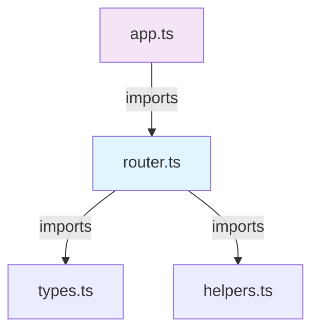

# /code-graph-mapper - Dependency Graph Visualization

Map how code modules, functions, and imports connect — for understanding architecture, spotting circular dependencies, and tracing data flow.

## Usage

```
/code-graph-mapper src/                              # Map entire directory (auto-format)
/code-graph-mapper src/core/index.ts                 # Map single file
/code-graph-mapper src/ --format mermaid              # Mermaid diagram (visualizable)
/code-graph-mapper src/ --format dot                  # Graphviz DOT (publishable)
/code-graph-mapper src/ --format json                 # Structured JSON (programmatic)
/code-graph-mapper src/ --depth 2                     # Limit traversal depth
/code-graph-mapper src/ --language ts                 # Force TypeScript parser
```

## Output Formats

| Format | Best For | Output |
|--------|----------|--------|
| **markdown** (default) | Reading + understanding | Bulleted dependency tree |
| **mermaid** | Visual graphs + GitHub docs | Diagram syntax, renderable in MD |
| **dot** | Graphviz tools, publication | `.dot` file for `dot -Tpng` etc |
| **json** | Tooling, programmatic analysis | Nodes + edges, structured |

## Depth Levels

| Depth | Scope |
|-------|-------|
| 1 | Direct imports only |
| 2 | Direct + one level deep |
| 3 | Standard (default) - balanced view |
| 4 | Deep - shows all transitive deps |
| 5 | Maximum - can be verbose for large codebases |

## Example Output (Markdown Format)

```
# Dependency Graph: src/

## Module: src/core/router.ts
- Imports:
  - `./types.ts` (local)
  - `lodash` (external)
  - `@utils/helpers` (alias)
- Exported functions:
  - `Router(config)`
  - `RouteMiddleware()`
- Imported by:
  - `src/app.ts`
  - `src/plugins/loader.ts`

## Circular Dependencies
- ⚠️ src/bus.ts <--> src/event-emitter.ts

## Statistics
- Total modules: 24
- Total functions: 187
- Circular dependency count: 1
- Average imports per module: 3.2
```

## Example Output (Mermaid Format)



## Example Output (JSON Format)

```json
{
  "graph": {
    "nodes": [
      {
        "id": "src/core/router.ts",
        "type": "file",
        "language": "typescript",
        "functions": ["Router", "RouteMiddleware"]
      }
    ],
    "edges": [
      {
        "from": "src/core/router.ts",
        "to": "src/core/types.ts",
        "type": "import",
        "local": true
      }
    ],
    "cycles": []
  },
  "stats": {
    "total_modules": 24,
    "total_functions": 187,
    "circular_dependencies": 1
  }
}
```

---

## Algorithm

1. **Parse target** (file or directory)
2. **Detect language** (by extension or `--language` flag)
3. **Extract imports/requires** (regex or AST parsing for target language)
4. **Build dependency graph** (nodes = modules, edges = imports)
5. **Detect cycles** (Tarjan's algorithm)
6. **Serialize** (format requested)
7. **Report** (with statistics + warnings)

---

## Language Support

| Language | Parser | Status |
|----------|--------|--------|
| JavaScript | Regex (import/require) | ✓ Stable |
| TypeScript | Regex + alias resolution | ✓ Stable |
| Python | Regex (import/from) | ✓ Stable |
| Go | Regex (import) | ✓ Stable |
| Rust | Regex (use/mod) | ✓ Stable |
| Other | Fallback (heuristic) | ~ Best effort |

---

## Implementation Notes

- **Circular dependency detection**: Warn when A → B → A found
- **Alias resolution**: If tsconfig.json or vite.config.ts exists, resolve path aliases (e.g., `@utils/` → `src/utils/`)
- **External vs local**: Distinguish between local imports (./foo) and packages (lodash)
- **Depth limiting**: Avoid infinite loops; truncate at requested depth
- **Large codebases**: For >500 files, auto-suggest `--depth 2` or `--format json`
- **No modification**: Read-only; do not write changes

---

## Use Cases

- **Understanding architecture**: "Show me how modules interconnect"
- **Circular dependency hunting**: "Find cycles in the codebase"
- **Onboarding**: "Show me the import tree from main.ts outward"
- **Refactoring prep**: "What would break if I move this file?"
- **Documentation**: "Export this as a diagram for the README"

---

## Prerequisites

No external tools required. Uses language-specific regex parsers. For Graphviz output, user can run `dot -Tpng graph.dot -o graph.png` on their machine.

---

## Next Steps

If user wants to:
- **Fix circular deps**: Suggest `/simplify --circular-break`
- **Understand module**: Use `/learn [module-url]`
- **Trace call flow**: Use `/debug-mantra --trace-calls`
- **Commit findings**: Use `/forward --save-context`
